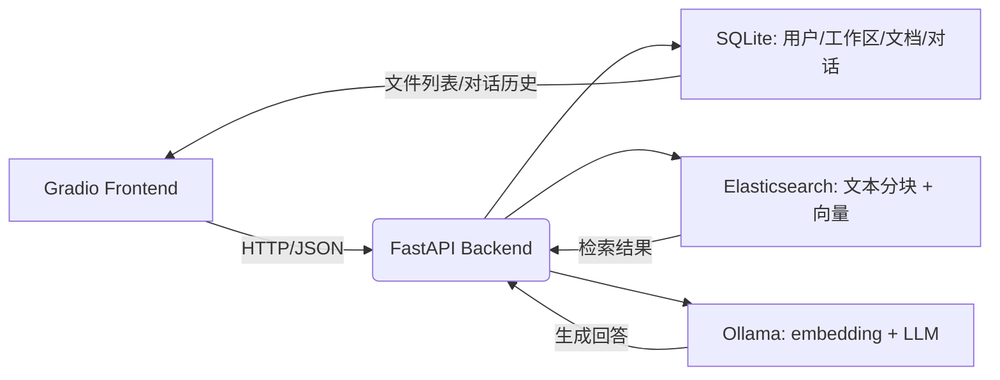

# 🌟 SmallRAG — 轻量级多用户 RAG 文档问答系统

> 基于 **FastAPI + Gradio + Elasticsearch + Ollama** 构建的本地化多用户 RAG 系统，支持 PDF 上传、智能分块、混合检索与对话管理。


*（示意图：前端 Gradio ↔ 后端 FastAPI ↔ Elasticsearch + SQLite + Ollama）*

---

## 📌 核心特性

- ✅ **多用户支持**：独立账号、密码登录，数据完全隔离  
- 📁 **多工作区管理**：每个用户可创建多个工作区（如 `项目A`、`个人笔记`）  
- 📄 **PDF 文档处理**：自动解析、分页分块、生成 768 维嵌入向量  
- 🔍 **混合检索引擎**：  
  - 全文检索（基于 `ik_max_word` 中英文分词）  
  - 向量检索（Elasticsearch `dense_vector` + 余弦相似度）  
  - RRF 融合 + 重排序（RankModel）  
- 💬 **对话系统**：  
  - 可选是否启用 RAG  
  - 多轮对话历史自动保存  
  - 按工作区切换对话上下文  
- 🛡️ **安全可靠**：  
  - 密码哈希存储（Werkzeug）  
  - 文件 SHA256 去重  
  - 严格权限校验（用户 + 工作区双维度）

---

## 🧩 技术栈

| 组件 | 技术 |
|------|------|
| **前端** | Gradio |
| **后端 API** | FastAPI |
| **向量数据库** | Elasticsearch 8.x（需安装 `ik` 分词插件）|
| **关系数据库** | SQLite |
| **嵌入模型** | Ollama（如 `nomic-embed-text`）|
| **大语言模型** | Ollama（如 `llama3`）或 OpenAI API |
| **文件解析** | `pdfplumber` |
| **任务队列（预留）** | Celery + Redis |

---

## 🚀 快速开始

### 1. 环境准备

```bash
# 克隆项目
git clone https://github.com/yourname/smallrag.git
cd smallrag

# 创建虚拟环境（推荐）
python -m venv venv
source venv/bin/activate  # Linux/macOS
# venv\Scripts\activate   # Windows

# 安装依赖
pip install -r requirements.txt
```

### 2. 启动依赖服务

#### Elasticsearch（需安装 `ik` 中文分词插件）
```bash
# Docker 方式（推荐）
docker run -p 9200:9200 -p 9300:9300 -e "discovery.type=single-node" elasticsearch:8.11.0
```

> 💡 插件安装参考：[elasticsearch-analysis-ik](https://github.com/medcl/elasticsearch-analysis-ik)

#### Ollama（提供 embedding 和 LLM）
```bash
# 安装 Ollama（https://ollama.com/）
ollama pull nomic-embed-text   # 嵌入模型（768维）
ollama pull llama3             # 大语言模型
```

### 3. 启动后端服务

```bash
# 启动 FastAPI（端口 8000）
python backend.py
```

### 4. 启动前端界面

```bash
# 启动 Gradio（端口 7860）
python main.py
```

然后访问：http://localhost:7860

---

## 📂 项目结构

```
smallrag/
├── data/                       # 用户数据存储（自动生成）
│   └── users/{username}/
│       ├── uploads/{workspace}/
│       └── conversations/
├── data.db                     # SQLite 数据库
├── backend.py             # FastAPI 后端
├── main.py              # Gradio 前端
├── dataSQL.py                  # SQLAlchemy 模型
├── dataSchames.py              # Pydantic 模型
├── dataES.py                   # Elasticsearch 封装
├── model.py                    # LLM/Embedding/Ranker 接口
├── utills.py                   # PDF 解析与分块
├── requirements.txt
└── README.md
```

---

## 🧪 使用流程

1. **注册账号** → 自动创建 `default` 工作区  
2. **上传 PDF** → 系统自动解析、分块、生成嵌入  
3. **切换工作区**（可选）→ 隔离不同项目文档  
4. **开始聊天** → 勾选“启用 RAG”即可从文档中检索答案  
5. **管理对话** → 查看/切换历史会话，每条会话绑定到当前工作区

---

## ⚠️ 注意事项

- 当前仅支持 **PDF 格式**，后续将扩展 DOCX/TXT  
- 文件上传为**同步处理**，大文件可能阻塞 UI（异步任务已预留接口）  
- **创建工作区功能尚未实现**（前端有入口，后端需补充 API）  
- 首次启动会自动创建 Elasticsearch 索引（`smallrag_*`）

---

## 🔧 配置说明（`model.py`）

如需切换模型，修改以下部分：

```python
# model.py 示例
class Embedding:
    def __init__(self):
        self.model_path = "/home/dzl/PycharmProjects/SmallRag/BAAI/bge-base-zh-v1.5"
        self.model = SentenceTransformer(self.model_path)

    def embed(self,text:str)->np.ndarray:
        return self.model.encode(text)

    def check_similarity(self,embedding1,embedding2):
        similarity = self.model.similarity(embedding1, embedding2)
        return similarity.numpy()
    
class ChatCompletion:
    def __init__(self):
        self.model = "qwen-max"
        self.system_prompt = """你是一个智能助手，请直接、准确地回答用户的问题。不要添加解释、前缀或后缀，仅输出答案本身。"""
        self.system_prompt_context = """你是一个智能助手，请根据以下规则回答用户问题：
                                        1. 如果提供的上下文与用户问题相关，请严格依据上下文内容作答，不要编造信息。
                                        2. 如果上下文与问题无关、信息不足或无法回答，请直接回答“无法根据提供的信息回答该问题。”不要自己回答
                                        3. 回答应简洁明了，仅输出答案本身，不要添加解释、前缀（如“答案是：”）或后缀。"""
        self.client = openai.OpenAI(
            api_key="sk-ea07bf0880504b65a31b1bce38417fcf",
            base_url="https://dashscope.aliyuncs.com/compatible-mode/v1",  # 修复多余空格
        )


```

---

## 🤝 贡献与扩展

欢迎提交 Issue 或 PR！可扩展方向：

- [ ] 异步文件处理（Celery）
- [ ] 多格式文档支持（DOCX, PPTX, TXT）
- [ ] 对话标题编辑与删除
- [ ] 工作区共享（RBAC 权限）
- [ ] 文件预览（PDF.js）

---
