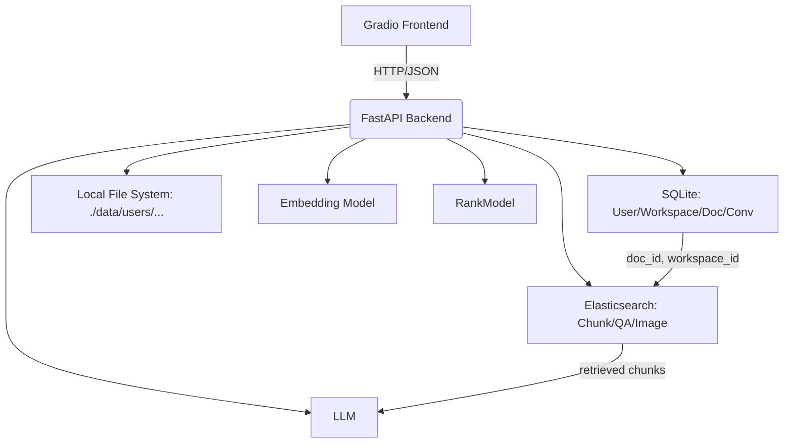
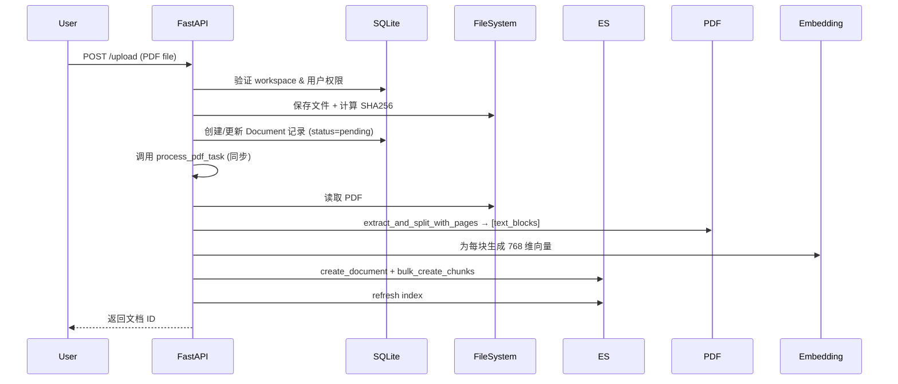
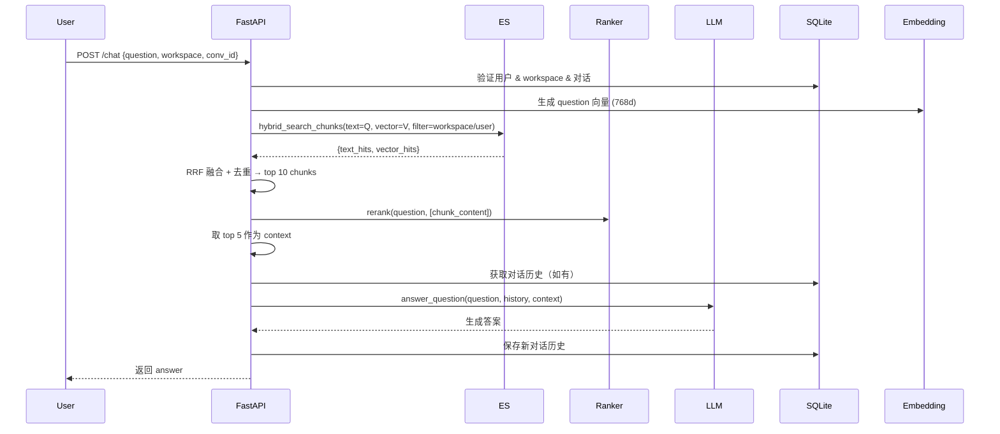

# SmallRAG 系统架构设计文档（FastAPI + Gradio 版）

---

## 1. 系统概览

SmallRAG 是一个**多用户、多工作区、支持文档问答与多模态检索的轻量级 RAG 系统**。系统以 **FastAPI 构建后端 RESTful API**，以 **Gradio 构建前端交互界面**，后端整合 **SQLite（关系数据）** 与 **Elasticsearch（向量+全文检索）**，并通过 **异步任务机制（Celery）预留扩展能力**（当前为同步处理）。

核心能力：
- ✅ 用户注册/登录认证
- ✅ 多工作区（Workspace）隔离
- ✅ PDF 文档上传、智能分块、嵌入生成
- ✅ 混合检索：BM25 全文 + 向量 KNN + RRF 融合 + 重排序（RankModel）
- ✅ 对话历史持久化（JSON 存储）
- ✅ 文件去重（SHA256 哈希比对）
- ✅ 中英文混合文本处理（`ik_max_word` 分词器）

---

## 2. 技术栈全景

| 层级 | 组件 |
|------|------|
| **Web 框架** | FastAPI |
| **前端 UI** | Gradio（调用 FastAPI 接口）|
| **关系数据库** | SQLite + SQLAlchemy ORM |
| **向量/全文引擎** | Elasticsearch 8.x（`dense_vector` + `ik` 分词）|
| **嵌入模型** | 自定义 `Embedding` 类（768 维）|
| **重排序模型** | `RankModel`（如 BGE-reranker）|
| **大模型** | `ChatCompletion`（如本地 LLM 或 API）|
| **异步任务** | Celery + Redis（预留，当前同步执行）|
| **文件处理** | `pdfplumber` + 自定义分页分块逻辑 |
| **安全** | Werkzeug 密码哈希 + FastAPI 依赖注入鉴权 |

---

## 3. 模块架构



---

## 4. 核心数据流

### 4.1 文档上传与处理流程


> 🔔 当前为**同步处理**（`process_pdf_task` 直接调用），已预留 Celery 装饰器注释，便于未来异步化。

---

### 4.2 问答检索与生成流程


> ✅ **检索策略**：BM25 + 向量 KNN → RRF 融合 → 重排序 → top-k 上下文

---

## 5. API 接口设计（FastAPI）

| 方法 | 路径 | 功能 | 认证 |
|------|------|------|------|
| POST | `/register` | 用户注册（自动创建 default 工作区） | 无 |
| POST | `/login` | 用户登录 | 无 |
| GET | `/workspaces?current_user=xxx` | 获取用户所有工作区 | Query Param |
| GET | `/workspaces/files?workspace_name=xxx&current_user=xxx` | 获取工作区文件列表 | Query Param |
| POST | `/workspaces/upload` | 上传 PDF 文件（表单） | Form Param |
| DELETE | `/workspaces/{user}/{ws}/documents/{file}` | 删除文档 | 路径参数 |
| GET | `/workspaces/{user}/{ws}` | 获取对话列表 | 路径参数 |
| GET | `/workspaces/{user}/{ws}/{conv_id}` | 获取对话消息历史 | 路径参数 |
| POST | `/chat` | 发起 RAG 问答 | Body: `chatRequest` |

> 🔐 **权限控制**：所有接口通过 `current_user` + `workspace_name` 双重校验，确保数据隔离。

---

## 6. 数据模型设计

### 6.1 关系数据库（SQLite）
| 表 | 字段（关键） | 说明 |
|----|-------------|------|
| `users` | username (PK), password_hash | 用户账户 |
| `workspaces` | id (PK), name, user_username (FK) | 工作区（用户隔离）|
| `documents` | id (PK), filename, file_path, file_hash, workspace_id (FK), embedding_status | 文档元数据 |
| `conversations` | id (PK), title, messages (JSON), user_username (FK), workspace_name | 对话历史 |

> 📁 **文件存储**：`./data/users/{username}/uploads/{workspace}/{filename}`

### 6.2 向量数据库（Elasticsearch）
| 索引 | 文档模型 | 关键字段 |
|------|--------|--------|
| `smallrag_document_meta` | `DocumentMeta` | `full_content`, `abstract`（全文检索）|
| `smallrag_chunk_info` | `ChunkInfo` | `chunk_content`（`ik_max_word`），`embedding_vector`（768d dense_vector）|
| `smallrag_qa_history` | `QAHistory` | `question`/`answer`（`ik_smart`），双 768d 向量 |
| `smallrag_image_info` | `ImageInfo` | `caption`（`ik_smart`），`tags`（keyword），512d 向量 |

> ✅ **过滤支持**：所有 ES 查询均按 `workspace_id` + `user_username` 过滤，保障多租户隔离。

---

## 7. 安全与健壮性

- **输入验证**：Pydantic 模型校验（用户名格式、密码强度、确认一致性）
- **密码安全**：`werkzeug.security.generate_password_hash`
- **文件安全**：
  - 上传路径拼接防目录穿越（使用 `os.path.join` + 用户隔离）
  - SHA256 哈希去重，避免冗余处理
- **异常处理**：
  - 文件保存失败自动清理临时文件
  - ES 操作通过 `@safe_es_call` 装饰器统一捕获异常
- **事务管理**：SQLAlchemy Session 自动回滚（FastAPI 依赖注入）

---

## 8. 扩展性设计

| 方向 | 当前状态 | 未来扩展 |
|------|--------|--------|
| **异步处理** | 同步执行 `process_pdf_task` | 启用 Celery，支持大文件后台处理 |
| **多模态** | 图像模型已定义（`ImageInfo`） | 接入 CLIP/ViT 实现图文检索 |
| **权限模型** | 用户级隔离 | 支持工作区共享（RBAC）|
| **嵌入模型** | 固定 `Embedding()` | 支持多模型切换（配置化）|
| **前端** | Gradio | 可替换为 React/Vue SPA |

---

## 9. 部署结构

```
project/
├── data/
│   └── users/                 # 用户文件存储
├── data.db                   # SQLite 数据库
├── main.py                   # FastAPI 入口
├── dataSQL.py                # SQLAlchemy 模型
├── dataSchames.py            # Pydantic 模型
├── dataES.py                 # Elasticsearch 封装
├── model.py                  # LLM/Embedding/Ranker 接口
├── utills.py                 # PDF 解析与分块
└── requirements.txt
```

**依赖服务**：
- Elasticsearch (http://localhost:9200)
- Redis (redis://localhost:6379，Celery 用，当前非必需)

---

## 10. 总结

SmallRAG 是一个**工程完备、架构清晰、易于部署**的轻量级 RAG 系统，具备以下特点：

- **多用户隔离**：通过 `user_username` + `workspace_id` 实现数据安全边界
- **检索能力强**：融合 BM25、向量检索、RRF 融合、重排序四重策略
- **端到端闭环**：从文件上传 → 分块嵌入 → 混合检索 → LLM 生成 → 历史存储
- **生产就绪**：包含文件去重、异常处理、日志、权限校验等工程实践

该系统适用于企业知识库、个人文档问答、科研资料检索等中小规模场景，具备良好的可维护性与演进潜力。