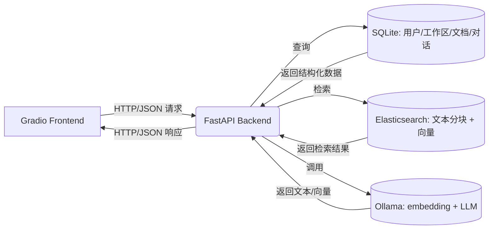

# SmallRAG 系统软件设计文档（Gradio 前端 + FastAPI 后端完整版）

---

## 一、系统目标

构建一个 **支持多用户、多工作区、可选 RAG 的本地化文档问答系统**，用户可上传 PDF 文档，在指定工作区中与大模型对话，系统自动从相关文档中检索信息增强回答。前端使用 Gradio 快速构建交互界面，后端以 FastAPI 提供 API，数据持久化通过 SQLite + Elasticsearch 实现。

---

## 二、整体架构



- **前端**：Gradio（单页应用，含登录/注册/主界面）
- **后端**：FastAPI（REST API）
- **存储**：
  - SQLite：结构化数据（用户、权限、状态）
  - Elasticsearch：非结构化内容（分块文本、嵌入向量）
  - 本地文件系统：原始文档（`./data/users/{user}/uploads/{workspace}/`）

---

## 三、前端功能设计（Gradio）

### 3.1 页面结构

| 页面 | 功能 | 状态管理 |
|------|------|--------|
| **登录页** | 用户名/密码登录 | 默认可见 |
| **注册页** | 新用户注册（密码确认） | 点击“去注册”切换 |
| **主页面** | 文件管理 + 聊天 + 对话管理 | 登录成功后显示 |

> ✅ **状态隔离**：所有用户相关操作均携带 `current_user`，由前端维护当前用户状态。

---

### 3.2 文件管理模块

| 功能 | 实现细节 | API 对应 |
|------|--------|--------|
| **工作区切换** | 下拉框选择已有工作区（如 `default`, `projectA`） | `GET /workspaces?current_user=xxx` |
| **上传文件** | 多文件选择（`file_count="multiple"`），点击上传 | `POST /workspaces/upload`（form-data） |
| **文件列表展示** | 表格显示：文件名、大小、修改时间，首列为复选框 | `GET /workspaces/files?workspace_name=xxx&current_user=xxx` |
| **删除文件** | 勾选多行 → 点击“删除选中行” | `DELETE /workspaces/{user}/{ws}/documents/{filename}` |
| **新建工作区** | 输入框 + “创建”按钮（**当前未实现后端接口**） | ⚠️ **待补充** |

> 🔍 **关键修正**：  
> 原设计“创建 upload 子文件夹”在前端体现为**创建工作区**，但当前代码**缺少创建工作区的 API 调用**，需补充。

---

### 3.3 对话与 RAG 模块

| 功能 | 实现细节 | 说明 |
|------|--------|------|
| **聊天窗口** | `gr.Chatbot(type="messages")` 支持角色区分 | 历史由前端 `self.history` 维护 |
| **发送消息** | 输入框 + “发送”按钮，自动追加用户/助手消息 | 调用 `/chat` |
| **对话列表** | 表格显示：标题、修改时间，首列为复选框 | `GET /workspaces/{user}/{ws}` |
| **切换对话** | 勾选一行 → 点击“选择会话”，加载历史 | `GET /workspaces/{user}/{ws}/{conv_id}` |
| **启用 RAG** | 复选框控制（默认开启） | 前端传递开关，后端决定是否检索 |

> ✅ **RAG 范围绑定**：  
> 聊天时自动使用**当前工作区**的文档进行检索，确保上下文一致。

---

### 3.4 用户与会话管理

- **登录/注册**：表单提交 → 调用 FastAPI `/login` 或 `/register`
- **自动初始化**：登录成功后自动：
  1. 获取工作区列表
  2. 加载默认工作区的文件列表
  3. 加载最新对话作为当前会话
- **退出登录**：清空状态，返回登录页

---

## 四、后端功能设计（FastAPI）

### 4.1 核心 API 列表

| 方法 | 路径 | 功能 | 认证 |
|------|------|------|------|
| POST | `/register` | 用户注册（自动创建 `default` 工作区） | 无 |
| POST | `/login` | 用户登录 | 无 |
| GET | `/workspaces?current_user=xxx` | 获取用户所有工作区 | Query Param |
| POST | `/workspaces/upload` | 上传文件（multipart/form-data） | Form Param |
| GET | `/workspaces/files` | 获取工作区文件列表 | Query Param |
| DELETE | `/workspaces/{user}/{ws}/documents/{file}` | 删除文档 | 路径参数 |
| GET | `/workspaces/{user}/{ws}` | 获取对话列表 | 路径参数 |
| GET | `/workspaces/{user}/{ws}/{conv_id}` | 获取对话历史 | 路径参数 |
| POST | `/chat` | RAG 问答 | Body: `chatRequest` |

> 🔐 **权限控制**：所有接口通过路径或参数中的 `current_user` 校验归属，防止越权访问。

---

### 4.2 数据模型

#### (1) 关系数据库（SQLite）
| 表 | 关键字段 | 用途 |
|----|--------|------|
| `users` | `username` (PK), `password_hash` | 账户安全 |
| `workspaces` | `id`, `name`, `user_username` (FK) | 工作区隔离 |
| `documents` | `filename`, `file_hash`, `workspace_id`, `embedding_status` | 文档元数据与状态跟踪 |
| `conversations` | `id`, `title`, `messages` (JSON), `user_username`, `workspace_name` | 对话历史持久化 |

#### (2) 向量数据库（Elasticsearch）
| 索引 | 模型 | 检索能力 |
|------|------|--------|
| `smallrag_chunk_info` | `ChunkInfo` | 全文（`ik_max_word`）+ 向量 KNN（768d）+ 用户/工作区过滤 |

---

### 4.3 RAG 检索流程

1. 用户提问 → 生成 768 维向量
2. 在**当前工作区**内执行：
   - **BM25 检索**：`chunk_content` 匹配
   - **向量 KNN**：`embedding_vector` 相似度
3. **RRF 融合** + **重排序**（RankModel）→ 取 Top-5
4. 拼接上下文 → 调用 LLM 生成答案
5. 保存问答对到 `conversations.messages`

---

## 五、关键设计优化与问题修正

### 5.1 原始设计缺陷 vs 实际实现

| 原始设计问题 | 实际修正方案 | 说明 |
|------------|------------|------|
| “上传到 `./uploads/`” | 改为 `./data/users/{user}/uploads/{workspace}/` | 实现**用户隔离**，避免文件冲突 |
| “创建子文件夹” | 改为“创建工作区”（逻辑概念） | 由后端统一管理，前端不直接操作文件系统 |
| “保存对话”模糊 | 明确为 JSON 存储到 `conversations.messages` | 支持多轮历史回溯 |
| 未提权限控制 | 所有 API 携带 `current_user` + 工作区校验 | 防止 A 用户访问 B 用户数据 |

### 5.2 当前代码待完善点

| 问题 | 建议 |
|------|------|
| **缺少创建工作区 API** | 前端有输入框，但无后端接口。需补充 `POST /workspaces` |
| **新建工作区后未刷新** | 创建后应重新获取 `workspaceChoices` 并设为当前 |
| **对话标题固定为问题** | 应支持用户重命名（需更新 `Conversation.title`） |
| **无文件类型校验** | 建议后端限制仅 PDF（或扩展 DOCX/TXT） |
| **大文件阻塞 UI** | 应启用 Celery 异步处理，前端轮询状态 |

---

## 六、安全与健壮性设计

- **密码安全**：Werkzeug 哈希存储，登录时验证
- **文件安全**：
  - SHA256 哈希去重，避免重复处理
  - 路径拼接使用 `os.path.join`，防目录穿越
- **输入校验**：
  - 用户名：正则 `^[a-zA-Z0-9_]+$`
  - 密码：长度 ≥6，确认一致
- **错误处理**：
  - 文件上传/删除失败返回详细错误
  - ES 异常统一捕获（`@safe_es_call`）

---

## 七、部署与依赖

### 7.1 服务依赖
- **Elasticsearch**：http://localhost:9200（需安装 `ik` 分词插件）
- **Ollama**：提供 embedding 和 LLM 服务（如 `llama3`, `nomic-embed-text`）
- **可选**：Redis（用于 Celery 异步，当前非必需）

### 7.2 目录结构
```
project/
├── data/
│   └── users/                 # 用户隔离存储
├── data.db                   # SQLite 数据库
├── main_gradio.py            # Gradio 前端
├── main_fastapi.py           # FastAPI 后端
└── requirements.txt
```

---

## 八、总结

本设计文档在原始需求基础上，结合 **Gradio 前端代码** 与 **FastAPI 后端实现**，完成了以下关键升级：

1. **明确前后端职责边界**：前端负责交互，后端负责数据与安全；
2. **修正路径与权限模型**：从全局目录升级为用户-工作区两级隔离；
3. **补全 RAG 工作流细节**：从上传 → 分块 → 检索 → 重排序 → 生成；
4. **指出实现缺口**：如创建工作区 API 缺失、异步处理未启用等；
5. **强调安全实践**：密码哈希、输入校验、路径安全、权限过滤。

该系统已具备**可演示的完整功能闭环**，适合用于个人知识库、团队文档问答等场景，后续可逐步引入异步任务、多格式支持、对话重命名等增强功能。